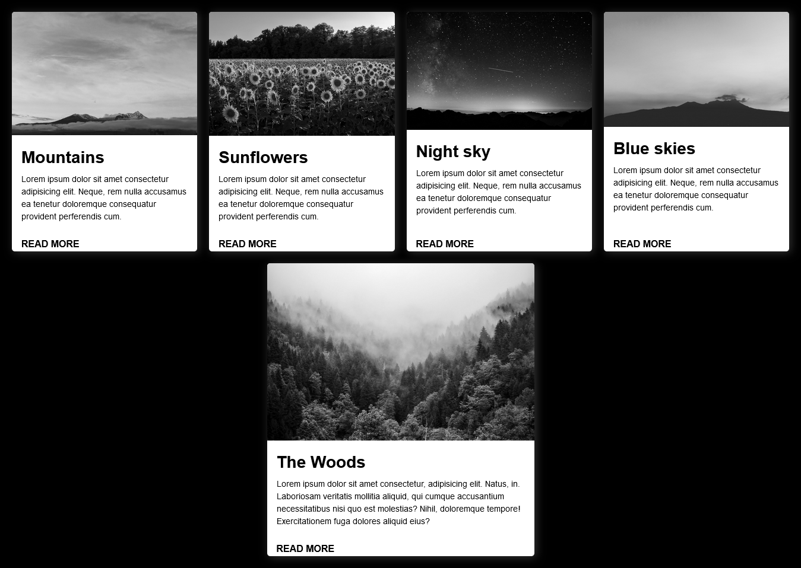

# CSS Cards

## Table of contents

- [Project Description](#project-description)
- [Screenshot](#screenshot)
- [Links](#links)
- [My process](#my-process)
  - [Built with](#built-with)
  - [What I learned](#what-i-learned)
- [Author](#author)
- [Acknowledgments](#Acknowledgments)

## Project Description

Responsive CSS cards using HTML and CSS

### Screenshot



## Links

- Live Site URL: (Github Pages)()

### What I learned

I learned flex wrap makes the cards responsive without using media queries.

```css
.cards-container {
  font-size: 1rem;
  flex-wrap: wrap;
  justify-content: center;
  gap: 1.25rem;
  margin: 1.25rem;
}
```

## My Process

### Built with

- Semantic HTML5 Markup
- Custom properties (variables)
- Flexbox
- CSS Grid
- Mobile-first workflow

## Useful Resources

[Scale on hover with transition](https://css-tricks.com/snippets/css/scale-on-hover-with-webkit-transition/)

## Author

- Frontend Mentor - [@bccpadge](https://www.frontendmentor.io/profile/bccpadge)
- Github - [@bccpadge](https://www.github/bccpadge)

## Acknowledgments

I took inspiration from this [Responsive card UI with flexbox and hover effects](https://www.youtube.com/watch?v=dwD8ZO3pnqs) Youtube video.
